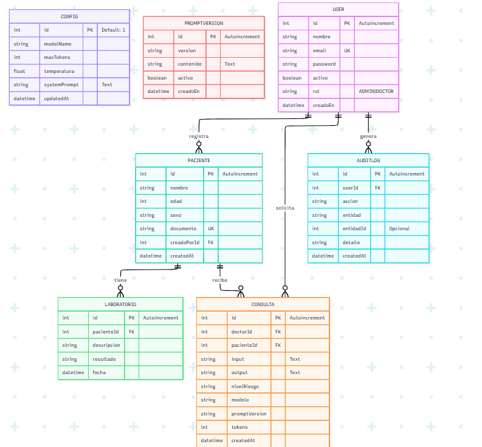
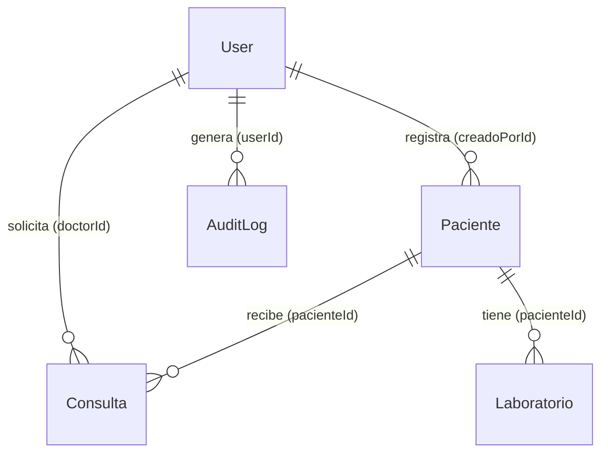

# MedReason AI — Documentación de Estructura y Diseño de Base de Datos

**Rol de Entrega:** DBA (Rosmeris)  
**Proyecto:** MedReason AI (ITLA, Mayo 2026)  
**Entregable:** Hito 1 (Sprints 0 y 1)

---

## 1. Introducción y Tecnologías

Esta sección documenta el inicio del desarrollo, la configuración del entorno, la estructura inicial modular y el diseño de persistencia del sistema **MedReason AI**.

- **Motor de Base de Datos:** PostgreSQL 16 (Relacional con soporte ACID completo).
- **ORM (Capa de Acceso a Datos):** Prisma ORM v7 (Type-safe).
- **Servidor Backend:** Node.js 20+ con Express.js y TypeScript.
- **Aislamiento:** Docker Compose para la base de datos PostgreSQL local.

## 1.2 Diagrama Entidad-Relación (ER)



---

## 1.1 Rediseño del Esquema de Datos (Cambios del Hito 1)

Como parte de la transición hacia el diseño de la base de datos definitiva de **MedReason AI**, se modificó y optimizó la estructura de base de datos previa (plantilla) aplicando los siguientes cambios lógicos de persistencia:

- **Tablas Eliminadas/Reestructuradas:**
  - `Doctor`: Se eliminó para unificar a todo el personal en la entidad `User` usando la asignación del rol `DOCTOR`, evitando la duplicidad de datos en tablas paralelas.
  - `Agenda`: Se eliminó por estar fuera del alcance exclusivo de apoyo diagnóstico web del sistema.
  - `HistorialPaciente`: Se fragmentó y reestructuró en las tablas `Consulta` y `Laboratorio` para separar ordenadamente las sugerencias diagnósticas y las pruebas clínicas.
- **Tablas Nuevas Creadas:**
  - `Consulta`: Para registrar la trazabilidad completa e inmutable de la IA (síntomas, nivel de riesgo, tokens consumidos, versión de prompt y modelo).
  - `Laboratorio`: Para registrar los resultados de análisis y exámenes complementarios del expediente de cada paciente.
  - `Config`: Modelo tipo Singleton para editar en tiempo real los parámetros del modelo de Gemini AI (temperatura, prompt, tokens).
  - `PromptVersion`: Para registrar las modificaciones al prompt del sistema y asegurar reproducibilidad clínica.
  - `AuditLog`: Bitácora inmutable de eventos de seguridad (inicios de sesión, modificaciones, etc.).
- **Correcciones del Motor de Base de Datos:**
  - Se actualizó el provider del generador a `"prisma-client-js"`.
  - Se eliminó la propiedad estática `url` en la directiva `datasource db` para delegar la conexión al cargador dinámico de `prisma.config.ts` de Prisma v7.

---

## 2. Estructura Inicial del Proyecto (Carpetas y Módulos)

El backend sigue una arquitectura limpia modular por dominio (Feature Folders). Para este Entregable 1, se han creado y estructurado los directorios y archivos base (esqueletos en blanco) para garantizar que el desarrollo sea ordenado y sin colisiones entre desarrolladores:

```text
medical-ai-backend/
├── prisma/                          # Archivo de schema de base de datos
│   └── schema.prisma
├── src/
│   ├── generated/                   # Cliente Prisma autogenerado
│   ├── configurations/              # Configuraciones globales
│   │   ├── configs.ts               # Variables con Zod
│   │   ├── constant.ts              # Constantes del sistema
│   │   └── lib/
│   │       └── prisma.ts            # Singleton de conexión
│   ├── modules/                     # Módulos modulares creados en blanco (Plantillas)
│   │   ├── auth/                    # Rutas, servicios y controlador de login (RF-01)
│   │   ├── consulta/                # Lógica del motor Gemini e historial (RF-13)
│   │   ├── pacientes/               # CRUD de expediente médico (RF-07)
│   │   └── admin/                   # Gestión de usuarios, métricas y prompts (RF-24)
│   ├── Shared/                      # Middlewares y utilidades compartidas
│   │   ├── middlewares/
│   │   │   ├── auth.middleware.ts   # Autenticación JWT y RBAC (RF-03, RF-04)
│   │   │   ├── rateLimit.middleware.ts # Control de peticiones (BE-21)
│   │   │   └── errorHandlerGlobal.ts  # Manejo centralizado de excepciones
│   │   └── utils/
│   │       ├── audit.helper.ts      # Registro de logs inmutables (RF-20)
│   │       └── formatPrompt.ts      # Constructor del prompt para la IA (BE-11)
│   └── index.ts                     # Punto de entrada del servidor Express
├── docker-compose.yml               # Orquestación de PostgreSQL local
├── tsconfig.json                    # Configuración estricta de TypeScript 6
├── .env.example                     # Plantilla de variables de entorno públicas
└── documentacion_db.md              # Guía master de arquitectura de datos
```

---

## 3. Configuración del Compilador TypeScript (`tsconfig.json`)

Para evitar fallos de compilación en el servidor y asegurar la correcta interpretación de los módulos ES6 modernos (ya que el proyecto usa `"type": "module"` en su `package.json`), se optimizó el archivo `tsconfig.json`:

- **Configuración del Módulo:** Ajustado a `"module": "esnext"` para compilar en formato nativo de ES Modules (ESM).
- **Resolución de Módulos:** Ajustado a `"moduleResolution": "bundler"`. Esto soluciona la incompatibilidad que tenía el resolvedor anterior con ESM y evita las advertencias de obsolescencia de `"node" (node10)` en TypeScript 6.
- **Limpieza de Parámetros:** Se configuró el compilador con `"noUnusedLocals": true` y `"noUnusedParameters": true`. Para cumplir esto sin romper el build en los archivos en blanco creados para el equipo, los parámetros intencionalmente vacíos se prefijaron con un guion bajo (ej. `_req`, `_res`).

---

## 4. Diccionario de Datos (Entidades y Atributos)

El esquema implementado en `schema.prisma` consta de **7 entidades** esenciales del sistema:

### 4.1 Tabla: `User`

- `id` (Int, PK, Autoincremental): Identificador único.
- `nombre` (String): Nombre del usuario.
- `email` (String, Unique): Correo de acceso.
- `password` (String): Hash de contraseña cifrada con `bcrypt`.
- `activo` (Boolean, Default: `true`): Estado de la cuenta.
- `rol` (Enum `Rol`): Permisos del usuario (`ADMIN` o `DOCTOR`).
- `creadoEn` (DateTime, Default: `now()`): Fecha de registro.

### 4.2 Tabla: `Paciente`

- `id` (Int, PK, Autoincremental): Identificador único.
- `nombre` (String): Nombre del paciente.
- `edad` (Int): Edad biológica del paciente.
- `sexo` (String): Sexo biológico.
- `documento` (String, Unique): Identificación única (cédula/DNI).
- `creadoPorId` (Int, FK): Vincula al médico (`User`) que lo registró.
- `createdAt` (DateTime, Default: `now()`).

### 4.3 Tabla: `Consulta`

- `id` (Int, PK, Autoincremental): Identificador de consulta.
- `doctorId` (Int, FK): Médico solicitante (`User`).
- `pacienteId` (Int, FK): Paciente analizado (`Paciente`).
- `input` (String): Síntomas y cuadro clínico enviado a la IA.
- `output` (String): Sugerencias diagnósticas y análisis devueltos por Gemini.
- `nivelRiesgo` (String): Nivel de riesgo (`Alto`, `Medio`, `Bajo`).
- `modelo` (String): Nombre del modelo usado (ej. `gemini-2.5-flash`).
- `promptVersion` (String): Versión del prompt usada.
- `tokens` (Int): Tokens consumidos.
- `createdAt` (DateTime, Default: `now()`).

### 4.4 Tabla: `Laboratorio`

- `id` (Int, PK, Autoincremental): Identificador.
- `pacienteId` (Int, FK): Paciente asociado.
- `descripcion` (String): Prueba (ej. "Glucosa en sangre").
- `resultado` (String): Valores o diagnóstico.
- `fecha` (DateTime, Default: `now()`).

### 4.5 Tabla: `Config` (Singleton)

- `id` (Int, PK, Default: 1): Configuración única.
- `modelName` (String): Modelo IA activo.
- `maxTokens` (Int): Límite de salida de tokens.
- `temperatura` (Float): Control de aleatoriedad.
- `systemPrompt` (String, Text): Instrucciones principales del rol de la IA.

### 4.6 Tabla: `PromptVersion`

- `id` (Int, PK, Autoincremental).
- `version` (String): Etiqueta de la versión (ej. `"v1.0.0"`).
- `contenido` (String): Instrucciones del prompt.
- `activo` (Boolean, Default: `false`).

### 4.7 Tabla: `AuditLog` (Inmutable)

- `id` (Int, PK, Autoincremental).
- `userId` (Int, FK): Usuario responsable.
- `accion` (String): Tipo de acción realizada (ej. `"LOGIN"`).
- `entidad` (String): Tabla afectada.
- `entidadId` (Int, Opcional).
- `detalle` (String): Detalles.
- `createdAt` (DateTime, Default: `now()`).

---

## 5. Relaciones y Llaves Foráneas



- **Trazabilidad:** Las consultas y los registros de auditoría están forzosamente asociados a un `User` (médico/administrador) para evitar el anonimato de las consultas médicas.
- **Centralización Clínica:** El expediente de un paciente asocia automáticamente todos sus resultados de laboratorio (`Laboratorio`) y sus consultas a la IA (`Consulta`).

---

## 6. Índices de Rendimiento y Optimización (`DB-05`)

Para cumplir los tiempos de respuesta exigidos en los requisitos de rendimiento, se han añadido los siguientes índices en la estructura física:

1.  `User(email)`: Inicio de sesión inmediato.
2.  `Paciente(documento, nombre)`: Búsqueda rápida por cédula/nombre.
3.  `Consulta(doctorId, pacienteId, createdAt)`: Carga inmediata del historial del médico.
4.  `Laboratorio(pacienteId)`: Expediente clínico optimizado.
5.  `AuditLog(userId, createdAt)`: Paginación y búsqueda rápida de auditoría.

---

## 7. Variables de Entorno (`.env.example`)

El archivo [.env.example](file:///c:/Users/marielys%20j/medical-ai-backend/.env.example) sirve para que cualquier desarrollador sepa qué variables requiere configurar en su propio archivo local de credenciales `.env`:

- `DATABASE_URL`: URL de conexión a la DB PostgreSQL.
- `JWT_SECRET`: Llave secreta para autenticación con tokens JWT.
- `GEMINI_API_KEY`: API Key para las solicitudes a Google Gemini.
- `PORT`: Puerto del servidor web.

---

## 8. Guía de Configuración del Entorno para el Equipo

1.  **Levantar Base de Datos en Docker:**
    ```bash
    docker-compose up -d
    ```
2.  **Configurar Variables:** Copiar `.env.example` como `.env` e ingresar las claves.
3.  **Correr Migraciones y Generar Cliente:**
    ```bash
    npx prisma migrate dev --name init
    npx prisma generate
    ```
4.  **Ejecutar Seed:** Registrar el administrador por defecto y los prompts iniciales en la base de datos:
    ```bash
    npx prisma db seed
    ```
    - _Credenciales de Admin por defecto:_ `admin@medreason.ai` / `AdminPassword123!`
5.  **Iniciar Servidor de Desarrollo:**
    ```bash
    npm run dev
    ```

---

#  Sprint 1: Autenticación de usuarios por JWT y CRUD de Pacientes. DONE #

Resumen del Sprint: Módulo de Pacientes  
Este documento detalla todos los cambios y nuevas características implementadas para el Módulo de Pacientes durante este Sprint.

## Objetivo Cumplido ##
Se implementó por completo el CRUD de gestión de pacientes, la integración de resultados de laboratorio y la generación del expediente clínico completo. Todo el código fue tipado fuertemente con TypeScript, protegido con JWT y documentado en Swagger.

## Archivos Creados / Modificados ##

### 1. DTOs de Validación ###
pacientes.dto.ts

Se crearon las interfaces estrictas para asegurar que los datos enviados por el cliente sean correctos antes de tocar la base de datos:

CreatePacienteDto
UpdatePacienteDto
CreateLaboratorioDto

### 2. Lógica de Negocio (Service) ###
pacientes.service.ts

Se implementaron 7 métodos que interactúan directamente con Prisma (Base de datos):

* createPaciente: Valida que el documento de identidad no exista previamente.
* listPacientes: Implementa un sistema de búsqueda insensible a mayúsculas (busca por nombre o documento).
* getPacienteById / updatePaciente / deletePaciente: Operaciones estándar con validación de existencia.
* addLaboratorio: Registra pruebas de laboratorio asociadas a un paciente.
*getExpedienteCompleto: Query compleja que trae al paciente junto con todo su historial de laboratorios y consultas ordenadas por fecha.

### 3. Controladores ###

pacientes.controller.ts

Se enrutaron las peticiones HTTP hacia el servicio. Se incluyó un bloque try/catch riguroso en todos los métodos para atrapar errores y devolver los status codes correctos (200, 201, 400, 401, 404 y 500).

## 4. Rutas, Seguridad y Documentación ##
pacientes.routes.ts

Se definieron los 7 endpoints requeridos.

* Cada ruta está protegida por el authMiddleware (requiere un Bearer Token válido para ser consumida).
* Se redactó documentación JSDoc para Swagger (@swagger) en cada ruta, especificando parámetros, cuerpos de petición de ejemplo y respuestas esperadas.

### 5. Configuraciones Globales Modificadas ###
A. Archivo index.ts
Se agregó el router de pacientes en el prefijo oficial: app.use("/api/pacientes", routesPacientes);
Se agregó el dominio de la documentación (http://localhost:3006) a la lista blanca de CORS para que Swagger UI no sea bloqueado.
B. Archivo swagger.ts
Se configuró el componente de seguridad securitySchemes: { bearerAuth: { type: "http", scheme: "bearer" } }. Esto habilitó el candado 🔓 interactivo en la interfaz de Swagger para probar endpoints protegidos directamente desde el navegador.
C. Middlewares y Dependencias
Se corrigieron los tipos de retorno estrictos en auth.middleware.ts para cumplir con las reglas del linter.
Se instaló la librería @types/jsonwebtoken para evitar errores del compilador.

### Pruebas Realizadas ###

* Compilación y Linteo: Se ejecutó npx tsc --noEmit y npm run format. El proyecto compila con cero (0) errores.
* Registro y Login: Se probó el registro de un nuevo Doctor y la obtención exitosa del JWT Token.
* Flujo Protegido: Se enviaron peticiones a /api/pacientes sin token para validar el rechazo (401 Unauthorized).
* Flujo de Pacientes: Se inyectó el Token en Swagger y se probó la creación exitosa de un paciente (201 Created).


---

# Roadmap Técnico del Backend (Sprints)
---

### [ DONE ] ###
- **Sprint 0 (Actual - Entregable 1):** Diseño e implementación de base de datos, Docker, configuraciones de variables, inicialización de datos de prueba (seed) y esqueleto de directorios modulares. 
---
### [ DONE ] ###
 - **Sprint 1:** Autenticación de usuarios por JWT y CRUD de Pacientes. 
---

- **Sprint 2:** Lógica e integración con la API de Google Gemini 2.5.
- **Sprint 3:** Trazabilidad, logs de auditoría e historial clínico completo de consultas.
- **Sprint 4:** Métricas administrativas, control de versiones del prompt y gestión de médicos.
- **Sprint 5:** Suite de pruebas con Jest y verificación de seguridad con Helmet/Rate Limiting.
- **Sprint 6:** Pruebas finales de QA, optimización de queries y despliegue a Railway/Render.


- **Sprint 0 (Actual - Entregable 1):** Diseño e implementación de base de datos, Docker, configuraciones de variables, inicialización de datos de prueba (seed) y esqueleto de directorios modulares.
- **Sprint 1:** Autenticación de usuarios por JWT y CRUD de Pacientes.
- **Sprint 2:** Lógica e integración con la API de Google Gemini 2.5.
- **Sprint 3:** Trazabilidad, logs de auditoría e historial clínico completo de consultas.
- **Sprint 4:** Métricas administrativas, control de versiones del prompt y gestión de médicos.
- **Sprint 5:** Suite de pruebas con Jest y verificación de seguridad con Helmet/Rate Limiting.
- **Sprint 6:** Pruebas finales de QA, optimización de queries y despliegue a Railway/Render.
